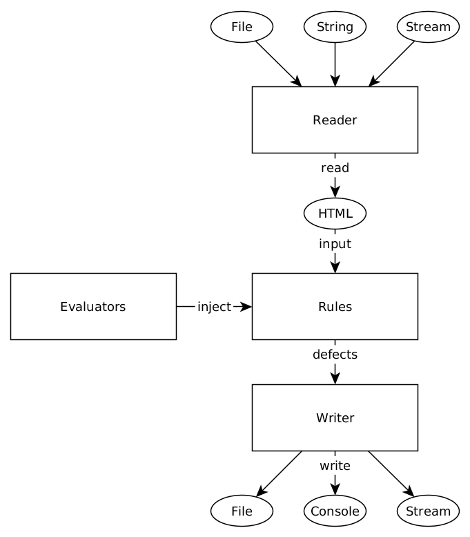

# Overview

## Flow of Processing

## Reader
- Handles HTML resource and convert it to a string for further usage.
- Pre-defined types:
  - StringReader
    - Read the HTML content from a string.
  - FileReader
    - Read the HTML content from a file.
  - StreamReader
    - Read the HTML content from a ReadableStream.
  
## Rule
- Tests the HTML content using Evaluators and returns any detected defects to Writer for output.
- Pre-defined types:
  - DomAMissingRelRule
    - Check if any `a` tag is missing `rel` attribute.
  - DomHeadCheckRule
    - Check if `title` tag is missing in the `head` tag.
    - Check if `meta` of description is missing in the `head` tag.
    - Check if `meta` of keywords is missing in the `head` tag.
  - DomImgMissingAltRule
    - Check if any `img` tag is missing `alt` attribute.
  - DomRedundantH1Rule
    - Check if there are more than one `h1` tag exist.
  - DomTooManyStrongRule
    - Check if there are too many `strong` tag exist.
    - The limit is configurable.
    
## Evaluator
- Provides functionality for Rules to test the HTML content.
- Pre-defined types:
  - CheerioEvaluator
    - Based on [cheerio](https://cheerio.js.org/) and provides jQuery-like syntax for checking HTML elements.
    
## Writer
- Handles evaluation results from Rules and write them out in various ways.
- Pre-defined types:
  - ConsoleWriter
    - Write the output to console.
  - FileWriter
    - Write the output to a file.
  - StreamWriter
    - Write the output to a WritableStream
    